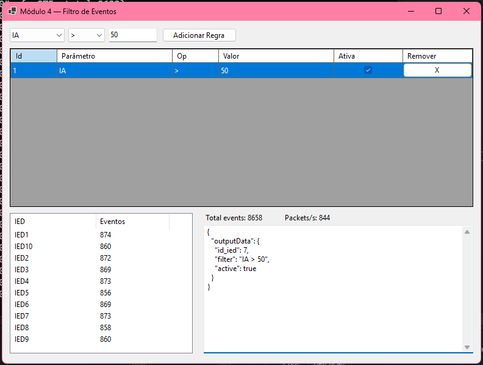

# Módulo 4 — Filtro de Eventos (WinForms)

<div align="justify">
Essa documentação apresenta o Módulo 4 do sistema supervisório de monitoramento de subestações, responsável pela filtragem dinâmica de parâmetros e detecção de 
eventos em tempo real. O módulo captura continuamente medições de corrente (IA, IB e IC) enviadas pelo hardware via UDP em intervalos mínimos de 10 ms, aplica 
regras definidas pelos usuários para identificar ativações e desativações de eventos. Caso ocorra uma mudança de estado, o Módulo 4 gera um relatório em JSON 
e o transmite ao módulo de monitoramento visual em até 500 ms após a detecção.
</div>

---

## Visão Geral
O Módulo 4 é um aplicativo **Windows Forms (.NET)** que:
1. Recebe medições via **UDP** na porta **5002**.  
2. Converte as amostras em objetos `CurrentMeasurement`.  
3. Avalia regras configuradas para os parâmetros **IA**, **IB** e **IC**.  
4. Gera eventos quando uma condição é satisfeita.  
5. Envia cada evento por **UDP unicast** para um destino definido no código.  
6. Exibe contadores por IED e o último JSON transmitido.  
7. Mantém o socket de recepção ativo mesmo em períodos de inatividade e faz **rebind automático em mudanças de rede** (Wi-Fi/VPN).  

---

## Estrutura de Arquivos

```
/src
├─ Program.cs            # Bootstrap do WinForms (entrypoint)
├─ Form1.cs              # Núcleo: RX/PROC/TX, motor de regras, robustez de rede e integração UI
├─ Form1.Designer.cs     # Layout da interface (controles, timers, grid de regras, listview de contadores)
└─ JsonMod3.cs           # Classe auxiliar para montar o payload JSON de saída
```

**Relações:**
- `Program.cs` instancia e executa `Form1`.  
- `Form1.cs` utiliza os controles definidos em `Form1.Designer.cs`.  
- `Form1.cs` usa `JsonMod3` para gerar o payload dos eventos em string e bytes.  

---

## Interface

- A interface segue o layout definido no Designer:  
  - **Grid** para listar, ativar/desativar e remover regras.  
  - **ListView** com contadores por IED.  
  - **Labels** com o total de eventos e com a quantidade de pacotes recebidos por segundo.  
  - **Textbox** (`txtLog`) mostrando o último JSON enviado.  
- Atualizações são feitas por timers para não bloquear a UI.  

<p align="center">
  
</p>

---

## Variáveis de Configuração

No topo de `Form1.cs`:

```csharp
private const string mod3Ip   = "192.168.56.1";
private const int    mod3Port = 6001;
private static readonly IPEndPoint _mod3Endpoint =
    new IPEndPoint(IPAddress.Parse(mod3Ip), mod3Port);
```

- `mod3Ip` e `mod3Port` definem o destino dos eventos enviados.  
- O envio é feito por **unicast** para `_mod3Endpoint`.  

---

## Principais Tipos

```csharp
public enum ComparisonOperator { Less, Equal, Greater }

public record CurrentMeasurement(DateTime Timestamp, string IedId, double IA, double IB, double IC);

public class RuleCondition
{
    public int Id;
    public string Parameter;   // "IA" | "IB" | "IC"
    public ComparisonOperator Operator;  // < | = | >
    public double Value;
    public bool Active;
    public bool Verify(CurrentMeasurement m); // compara o valor medido com a regra
}
```

---

## Fluxo de Dados

```
[UDP 5002] → RunReceiveLoopAsync → _receiveChannel ─┐
                                                    ├→ RunProcessingLoopAsync → EvaluateRulesWithTransitions
                                                    │                              │
                                                    │                              ├→ atualização dos contadores
                                                    │                              └→ TrySendEventToMod3
                                                    │                                         │
                                                    └──────────────────────────────────────────┴→ _sendChannel → RunSendLoopAsync → [UDP → mod3Ip:mod3Port]
```

---

## Threads e Canais

- **RunReceiveLoopAsync**  
  - Escuta pacotes em `0.0.0.0:5002` usando `UdpClient`.  
  - Mantém o socket aberto mesmo em períodos de inatividade.  
  - Recria o socket automaticamente em caso de erro real de rede ou quando ocorre mudança de rede (evento `NetworkChange.NetworkAddressChanged`).  
  - Escreve as mensagens recebidas no canal `_receiveChannel`.

- **RunProcessingLoopAsync**  
  - Lê mensagens do `_receiveChannel` a cada ~50 ms.  
  - Faz parsing de JSON (campos `idDispositivo`, `id`, `IedId`, `IA/IB/IC`) ou CSV (`IED,IA,IB,IC`).  
  - Converte os dados em `CurrentMeasurement` e aplica o motor de regras.  
  - Chama `FlushUiBatch(...)`, que mantém a interface responsiva sem exibir pacotes detalhados.

- **RunSendLoopAsync**  
  - Lê bytes do `_sendChannel` e envia via `UdpClient.SendAsync` para `_mod3Endpoint`.  
  - Realiza até 3 tentativas em caso de falha.  
  - Registra o último JSON enviado na interface.

---

## Motor de Regras

- As regras são armazenadas em `List<RuleCondition> _ruleList`, com acesso protegido por `lock`.  
- O estado anterior de cada regra é registrado para detectar transições.  
- Modos de disparo:
  - **Nível**: gera evento para cada amostra que satisfaz a regra.  
  - **Borda**: gera evento apenas quando ocorre mudança de estado (false→true ou true→false).  
- Contadores são atualizados por IED e em total acumulado.  
- A interface exibe essas informações de forma otimizada para não travar a UI.

---

## Envio de Evento

- A função `TrySendEventToMod3(rule, measurement, active)`:
  1. Monta o filtro em texto (ex.: `"IA > 100"`).  
  2. Usa `JsonMod3` para gerar string (UI) e bytes (envio).  
  3. Publica os bytes no `_sendChannel`.  


---

## Rede

- **Recepção (RX):** escuta na porta UDP **5002**.  
- **Transmissão (TX):** envia pacotes para `_mod3Endpoint` (por padrão `192.168.56.1:6001`).  
- O envio é sempre unicast, evitando broadcast na rede.  
- Em caso de mudança de rede, o socket é reaberto automaticamente para manter a comunicação.  
